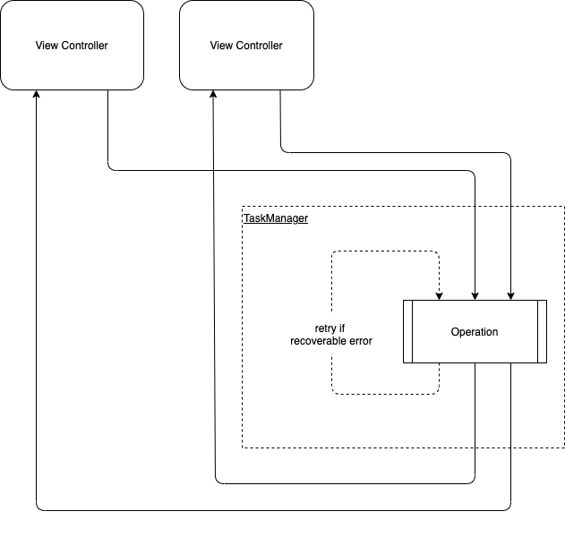

<br><br>
# Task Manager


- [Requirements](#requirements)
- [Installation](#installation)
- [Usage](#usage)
- [License](#license)

Task Manager is an element of an app’s core which manages asynchronous operations.  It implements advanced queue logic that takes into account the operation's dependencies and priorities.
Main purpose of TaskManager component is to incapsulate work with server, database and other background operations into unit-like operations or tasks. This will help separate business logic from UI and reuse operations across the app.



## Requirements

- iOS 11.0+
- Xcode 11.0+
- Swift 5.0+

## Installation

### CocoaPods

To integrate TaskManager into your Xcode project with CocoaPods, specify it in your `Podfile`:

```ruby
pod 'Shakuro.TaskManager'
```

Then, run the following command:

```bash
$ pod install
```

### Manually

If you prefer not to use CocoaPods, you can integrate Shakuro.TaskManager simply by copying them to your project.

## Usage

1. Create couple of operations by subclassing `BaseOperation`. Operation should be a complete and independent unit of business logic. 
2. Subclass `TaskManager` and override `.willPerformOperation()`. Dependencies between operations should be defined here. It is a good idea to create two separate `TaskManager` objects/subclasses: one to handle auth-related tasks and second - for all other work.
3. Start your tasks by calling `.performOperation()` or `.performGroup()` on `TaskManager`. Completions can be used to handle results.

Have a look into [TaskManagerExample](https://github.com/shakurocom/TaskManager/tree/master/TaskManagerExample)

### Important notes

Operation should have `operationHash` defined if it's work rely only on it's options. Hash is used in `.willPerformOperation()` to construct dependencies.

Dependencies between operations should be carefully considered. `.willPerformOperation()` should return already existing in queue (old) operation instead of a new one if both operations (old & new) are equal from business logic perspective. This will result in only single operation being executed with multiple completion callbacks.

Each task (operation or group of operations) can have a `retryHandler` to perform a retry under specified conditions. It is a perfect tool if you are dealing with unreliable server.

Usual flow: Interactor -> Options -> Task Manager (operations + dependencies inside) -> HTTP Client + Database -> Retry if error (for example session expired error) -> Completion block inside Interactor with typed result.

## License

Shakuro.TaskManager is released under the MIT license. [See LICENSE](https://github.com/shakurocom/TaskManager/blob/master/LICENSE) for details.

