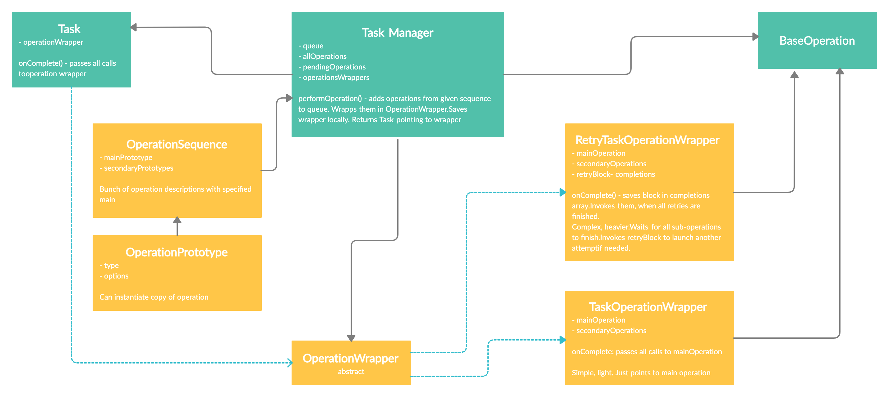

<br><br>
# Task Manager


Task Manager is a Swift library for managing various background tasks during the process of iOS development. It implements advanced queue logic that takes into account the operation's priority for the more efficient development of iOS apps.

- [Introduction](#Introduction)
- [Requirements](#requirements)
- [Installation](#installation)
- [Quick start](#quick-start)
- [Initialization, creating and performing an operation](#initialization,-creating-and-performing-an-operation)
- [Adding dependency](#adding-dependency)
- [Retry handler](#retry-handler)
- [License](#license)

## Introduction

Task Manager is an element of an app’s core with the help of which asynchronous operations get performed. It builds dependencies between operations and helps design the correct architecture of their app. It simplifies asynchronous programming, so you can focus on more important things. Perform many independent asynchronous operations simultaneously with one completion block. Every operation has it's own completion block

## How it works



Using Operation and OperationQueues you can create your own operations, encapsulating a unit of logic. You can specify and read a few additional properties to further encapsulate logic within the operation itself and keep track of its state. You can also specify a completionBlock that runs when an operation completes.

#Shakuro Task Manager Advantages:

1. Used Base operation. You can create your own operations that encapsulate a unit of logic, easily creating and overriding. A task can have a completion block (onComplete():) and pass all calls to the operation wrapper.
2. Operation Dependency. NSOperations are easy when it comes to task dependency management. It resolves dependencies between operations.
3. Added typing. You can request any type you want.
4. The ability to retry asynchronous operations.
5. It's transparent, flexible, and easy.

## Requirements

- iOS 13.0+
- Xcode 11.0+
- Swift 5.0+

## Installation

### CocoaPods

[CocoaPods](http://cocoapods.org) is a dependency manager for Cocoa projects. You can install it with the following command:

```bash
$ gem install cocoapods
```

To integrate TaskManager into your Xcode project, specify it in your `Podfile`:

```ruby
source 'https://github.com/CocoaPods/Specs.git'
platform :ios, '13.0'
use_frameworks!

target '<Your Target Name>' do
    pod 'Shakuro.TaskManager'
end
```

Then, run the following command:

```bash
$ pod install
```

### Manually

If you prefer not to use CocoaPods, you can integrate any/all components from the Shakuro iOS Toolbox simply by copying them to your project.

## Quick Start

1. To create task manager just subclass TaskManager and add http client that will be used in operations to communicate with server:

```swift
internal class ExampleTaskManager: TaskManager {

    private let randomOrgClient: HTTPClient

    init(name: String,
         qualityOfService: QualityOfService,
         maxConcurrentOperationCount: Int,
         randomOrgClient: HTTPClient) {
         
         self.randomOrgClient = randomOrgClient
         super.init(name: name,
         qualityOfService: qualityOfService,
         maxConcurrentOperationCount: maxConcurrentOperationCount)
    }
}

```
2. Creating your operation:

To create your operation just subclass BaseOperation<Int, ExampleOperationOptions>, where Int is type of result and ExampleOperationOptions is an input data for operation.

## Initialization, creating and performing an operation

You can request any type you want. In class FirstOperation in the example, it shows that ResultType should be Int.

## Adding dependency

A method that adds custom logic for specific operations. Use `type(of:)` or `operationHash` to identify operations in queue.
Default implementation returns input 'newOperation'.

- newOperation: newly-instantiated operation (from `performOperation()`)
- operationsInQueue: operations already in the queue. Not sorted. Can include operations, that were canceled or already in progress.
- returns: This method must return an operation that will **actually** be added to the queue. To enforce the uniqueness of an operation, return operation, that is already in the queue..
- warning: do not add new dependencies to an operation that is already in the queue.

```swift
// Example: 'sign in' operation is unique (at a time only single 'sign in' operation will be performed)

    let result: TaskManager.OperationInQueue
    switch newOperation {
    case let _ as SignInOperation:
        let signInInQueue = operationsInQueue.first(where: { (operation: Operation) -> Bool in
            return operation.operationHash == newOperation.operationHash
        })
        if let actualSignIn = signInInQueue {
            result = signInInQueue
        } else {
            result = newOperation
        }
        default:
            result = newOperation
        }
        return result
```

```swift
class ExampleTaskManager: TaskManager {

    private let randomOrgClient: HTTPClient

    init(name aName: String, qualityOfService: QualityOfService, maxConcurrentOperationCount: Int, randomOrgClient aRandomOrgClient: HTTPClient) {
        randomOrgClient = aRandomOrgClient
        super.init(name: aName, qualityOfService: qualityOfService, maxConcurrentOperationCount: maxConcurrentOperationCount)
    }

    // Adding dependencings to operations
   
    override func willPerformOperation(newOperation: TaskManager.OperationInQueue,
                                       enqueuedOperations: [TaskManager.OperationInQueue]) -> TaskManager.OperationInQueue {
        let result: TaskManager.OperationInQueue
        switch newOperation {
        case _ as UniqueOperation:
            let uniqueInQueue = enqueuedOperations.first(where: { $0.operationHash == newOperation.operationHash })
            result = uniqueInQueue ?? newOperation

        case _ as DependsOnAlwaysFailOperation:
            let dependencyInQueue = enqueuedOperations.first(where: { $0 is AlwaysFailInTheEndOperation })
            if let actualDependency = dependencyInQueue {
                newOperation.addDependency(operation: actualDependency, isStrongDependency: true)
            }
            result = newOperation

        default:
            result = newOperation
        }
        return result
    }
}
```

## Retry handler

RetryHandler — a bunch of blocks to handle retry logic. Provides the ability to reattempt a task if an error occurs.

```swift
 func retryAlwaysFailThreeTimes() -> Task<Int> {
    let retryCountMax = 3
    return doAlwaysFailInTheEndOperation(retryHandler: RetryHandler(
        retryCondition: { (retryNumber, taskResult) -> Bool in
            switch taskResult {
            case .success:
                return false
            case .failure:
                // process error
                if retryNumber < retryCountMax {
                    print("retrying...")
                    return true
                } else {
                    print("retrying no more.")
                    return false
                }
            }
    },
        willRetry: { print("will retry: attempt: \($0) result: \($1)") },
        didRetry: { print("did retry: attempt: \($0) result: \($1)") })
    )
}

func doAlwaysFailInTheEndOperation(retryHandler: RetryHandler<Int>?) -> Task<Int> {
       let group = OperationGroup(mainOperationType: AlwaysFailInTheEndOperation.self, options: ExampleOperationOptions())
       group.addSecondaryOperation(operationType: AlwaysFailInTheEndOperation.self, options: ExampleOperationOptions())
       group.addSecondaryOperation(operationType: AlwaysFailInTheEndOperation.self, options: ExampleOperationOptions())
       return performGroup(group, retryHandler: retryHandler)
}

// Operation that will allways fail

class AlwaysFailInTheEndOperation: BaseOperation<Int, ExampleOperationOptions> {

    override func main() {
        let stepCount: Int = 10
        for step in 1...stepCount {
            Thread.sleep(forTimeInterval: 0.5)
            print("AlwaysFailsInTheEndOperation: step \(step) / \(stepCount)")
        }
        finish(result: .failure(error: NSError(domain: "ExampleErrorDomain", code: 9001, userInfo: nil)))
    }

    internal override var priorityValue: Int {
        return 1
    }

    internal override var priorityType: OperationPriorityType {
        return OperationPriorityType.fifo
    }
}
```
## Callbacks

You can set willRetry and didRetry to get notified before or after the retry handler run.

## License

Shakuro iOS Toolbox is released under the MIT license. [See LICENSE](https://github.com/shakurocom/iOS_Toolbox/blob/master/LICENSE) for details.
